# GAMES课程 - 101 现代计算机图形学入门

Tags: 计算机图形学, GAMES, 笔记

**前言**：线性代数（对于我来说应该是高等代数，因为我们人工智能专业学的数学课是数学分析和高等代数）和计算机基础还是很重要也很有用的，至少在两者有一定基础的情况下有，学图形学会轻松很多。前面的前置科技树很容易就能看懂。除此之外也可以多了解了解游戏引擎的一些基本操作，理解起来也会更轻松一点。（或者也可以反过来，学了图形学基础之后游戏引擎也就更好看懂了）

> 视频：https://www.bilibili.com/video/BV1X7411F744
>
> 部分内容来自该视频评论区“达达挥大斧”与“maxshun”的笔记

## Lecture2 线代

### 向量的点乘

判断向量前与后的信息，结果>0为同方向，<0为反方向

vector_a · vector_b = [x_a,y_a] · [x_b, y_b] = x_a\*x_b + y_a\*y_b

### 向量的叉乘

输入两个向量，输出同时*垂直*两个向量的新向量

a x b = c

四指从a的方向向b的方向握紧，大拇指指向的就是c的方向

**如何判断两个向量的左右关系**

a×b得到结果是和z轴同向，是正的，说明b在a的左侧

进一步可以判断点是否落在某一三角形内部。

假设有一点P与三角形ABC

AB×AP > 0 说明P在AB左侧

BC×BP > 0 说明P在BC左侧

CA×CP > 0 说明P在CA左侧

说明点P落在三角形ABC内部

### 矩阵

第一个矩阵的列数与第二个矩阵的行数相等才能进行相乘，如：

第一个矩阵M行N列

第二个矩阵N行P列

得到M行P列的新矩阵

**快速运算位置为a行b列的元素**

新矩阵的a行b列元素=第一个矩阵a行和第二个矩阵b列做点积运算

**矩阵的性质**

- AB != BA
- (AB)C == A(BC)
- A(B+C) == AB + AC
- (A+B)C == AC + BC

**单位矩阵乘向量（用于变换）**

[[-1,0],[0,1]] * [x,y] == [-x,y]

**矩阵的转置**

x_i_j -> x_j_i

**矩阵的点乘与叉乘**

## Lecture3 变换

### 线性变换

> 以下线性变换均以图片的左下角为枢轴点，如配图所示，直到“平移”部分。

**缩放变换**

[[s_x,0],[0,s_y]]就叫缩放矩阵，与xy点乘得到缩放后的矩阵

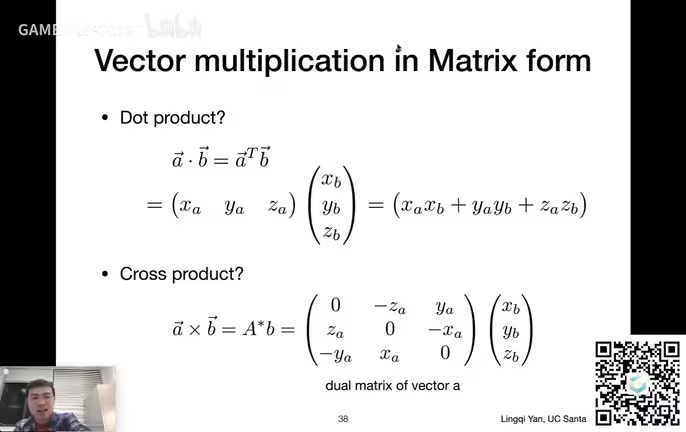

其中s_x代表x缩放倍率，s_y代表y缩放倍率。缩放均参照图像对应的原点进行倍乘。

**镜像变换**

本质是s_x / s_y为负值时产生的现象。

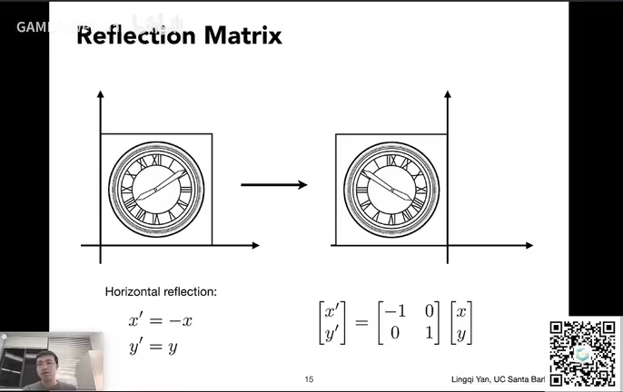

**错切变换**

[[1,a],[b,1]] 每个点添加bx+ay的偏移量。

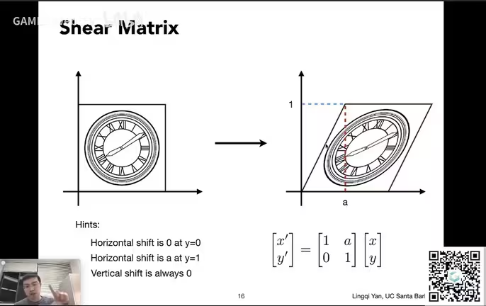

**旋转变换**

默认逆时针旋转

[[cos_theta,-sin_theta],[sin_theta,cos_theta]]

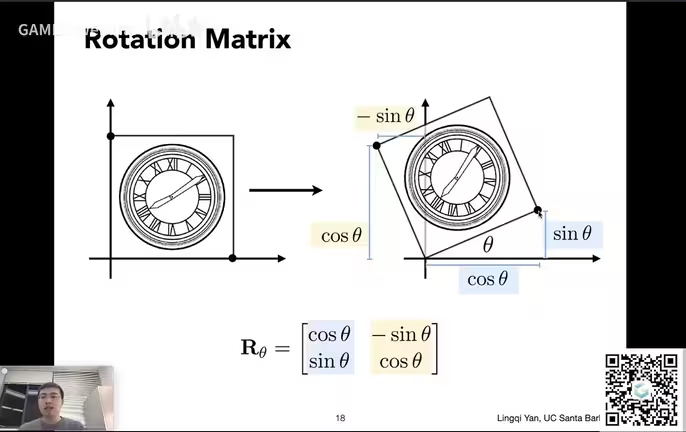

### 非线性变换

**平移**

平移无法写成线性变换的样子，于时引入**齐次坐标**

齐次坐标相当于为二维向量新增了一个维度。

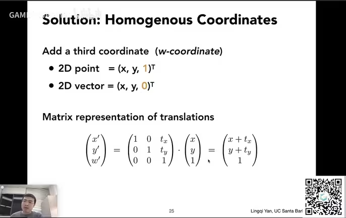

对于上述线性变换的齐次坐标形式，只需要在x=3，y=3处令其等于1即可

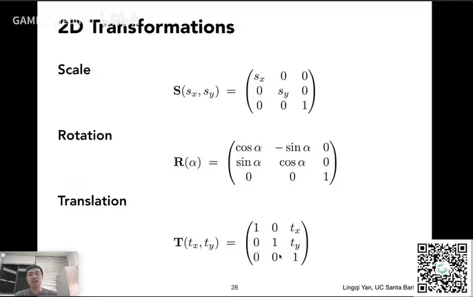

### 运算顺序

对一个点Point先进行旋转操作R，再进行平移T，写作T·R·Point，从右往左写，运算时也是从右往左运算。

## Lecture4 变换进阶

### 3D变换

3D变换相对于2D变换来说只是多增加了一个维度，可由2D变换举一反三得来（除旋转变换）。

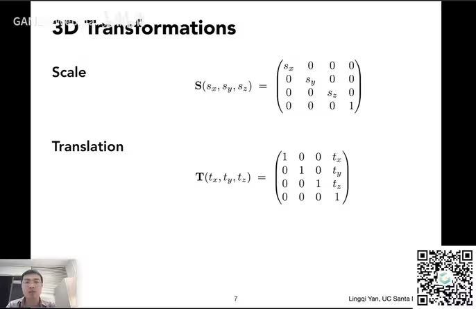

### 3D旋转

> 我们在使用一般的三元数描述旋转时一般使用飞机中的术语：roll，pitch，yaw
> - roll：滚转
> - pitch：俯仰
> - yaw：偏航

当分别绕xyz轴旋转时，变换公式如下图所示

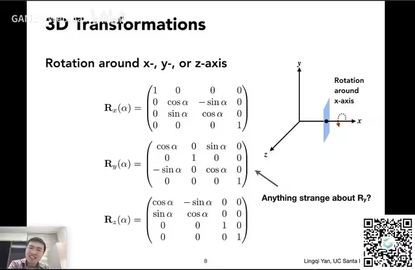

其中绕Y轴旋转时的矩阵比较特殊，表现出转置的状态。

这是因为X x Y = Z，Y x Z = X，X x Z = -Y

**罗德里格斯旋转公式**

我们说在三维空间内绕某一轴旋转，默认这个轴是过原点的

罗德里格斯旋转公式就是总结了绕任意过原点的轴旋转的公式

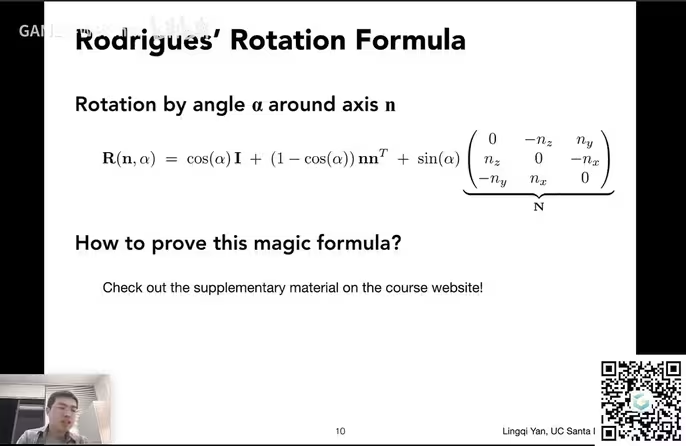

百度百科

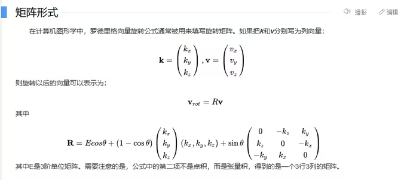

对于绕不过原点的轴旋转，我们可以将其拆分为

1. 将旋转轴平移到原点
2. 绕轴旋转
3. 将旋转后的模型平移回去

### 视图 / 相机变换

我们将该变换分为三部分：

1. **Model变换**：对目标物体进行变换
2. **View变换**：对摄像机的角度进行变换
3. **Projection变换**：将相机观察到的部分投影到视图中

#### View变换

该变换需要做到三件事：

1. 决定相机位置e
2. 决定相机看向的方向g
3. 决定相机头朝上的方向t

我们规定相机永远在(0,0,0)，并沿-Z方向看

变化的永远是其他物体

所以我们要先把相机归到原点，分为3步

1. 平移相机位置e至(0,0,0)
2. 将相机朝向的方向g旋转到-Z
3. 旋转相机头朝上的方向t到Y

总变换矩阵拆分为Mview=RviewTview

第一步平移直接用平移公式（注意变换矩阵的平移量为负数，因为是平移到原点）

第二三步由于将任意向量旋转到轴上比较难写，我们改为先求将轴旋转到任意向量的矩阵，再对矩阵求逆，即可得到任意向量旋转到轴的矩阵。

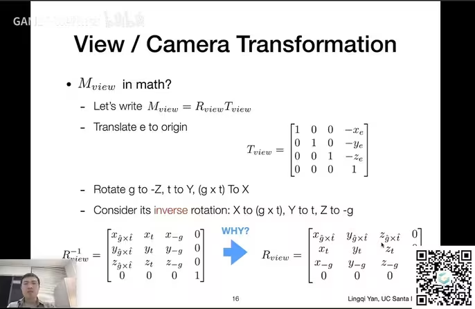

最后求出Mview，将Mview应用到相机，相机归零。同时也需要将Mview应用到其他所有物体，让物体和相机的相对位置保持不变

#### Projection变换

##### Orthographic Projection正交投影

> 先按照上面描述将相机位置与旋转归零

对于二维投影来说，直接把Z轴坐标舍弃，就能得到物体在xy平面上的投影

然后将得到的图像平移并且缩放到[-1,1]2中，方便之后的计算。（此时对象肯定会被拉伸，在后面的视口操作中我们会恢复这些拉伸。）

而对于正交投影，视口是个[l,r][b,t][f,n]的长方体，其中[l,r][b,t][f,n]分别为长方体在xyz方向上的区间。想让他变成[-1,1]3中的话只需要先将先将立方体的中心平移到原点，然后再将立方体缩放到[-1,1]3中即可。

所以正交投影矩阵如下

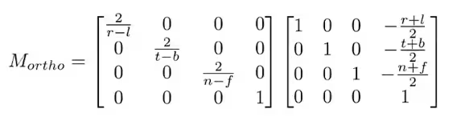

##### Perspective Projection透视投影

传统的欧式几何是在同一平面内生效的法则，在不同平面下就会造成近大远小的情况。

我们先将远平面以及远平面到近平面的所有平面缩放到近平面大小，然后做一次正交投影即可。

根据相似三角形定理，取一点(x,y,z,1)做变换，若近平面的对应点的深度为n，那么则首先有：

[x,y,z,1] => [nx/z,ny/z,unknown,1]

此时z轴未知，后面我们会推导出来

将这个点的所有坐标同时乘z得[nx,ny,unknown,z]，得到有某一矩阵M，满足：

M·[x,y,z,1] = [nx,ny,unknown,z]

可推导出矩阵的一部分，如下图

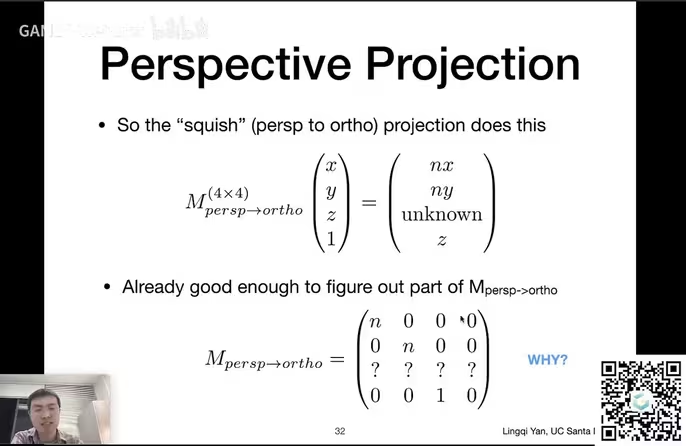

想补全这个矩阵，需要用到两条已知的性质

1. 近平面的点不会发生变化
2. 远平面的点z的值不会发生变化

应用于近平面的矩阵时，我们可以用n取代z，得到近平面的最终矩阵为[nx,ny,n2,n]，推出矩阵的形式必为[0,0,A,B]的形式，且**An+B = n2**

对于远平面，中心点[0,0,z,1]经矩阵变化后仍然是中心点[0,0,z,1]，得**Az+B = f2**

解得A=n+f,B=-nf

最终解出如下图所示得结果

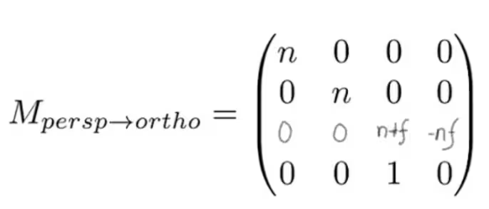

所以对于空间中任意一点进行透视变换可以通过如下公式解出

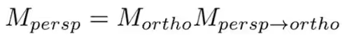

## Lecture5 光栅化

在之前的操作时，我们将所有的物体全部缩放到[-1,1]3的立方体中，接下来就需要将他画在屏幕上，这就叫光栅化。

在上文中，我们做了透视投影，将一个四棱梯挤压成正方形，但是透视投影需要视野角度以及大小来计算比例，所以我们需要定义视锥。

我们需要两个值来定义视锥：

- 宽高比
- 可视角度FOV（垂直角度和水平角度已知其中一个，就可以通过宽高比计算出另一个）

视锥仅是一个四棱锥，要将图像投影到屏幕上，我们还需要定义屏幕。

屏幕为二维数组，数组元素为像素，如1920*1080。屏幕坐标系的原点为左下角，向右为x轴正方向，向上为y轴正方向，像素的中心为(x+0.5,y+0.5)。

**视口变换**

如果我们暂时忽略z轴，只将[-1,1]2中的东西显示到[0,width]*[0,height]，那么只需要做缩放并平移就可以了，这个变换就被称为**视口变换**

视口变换的矩阵：

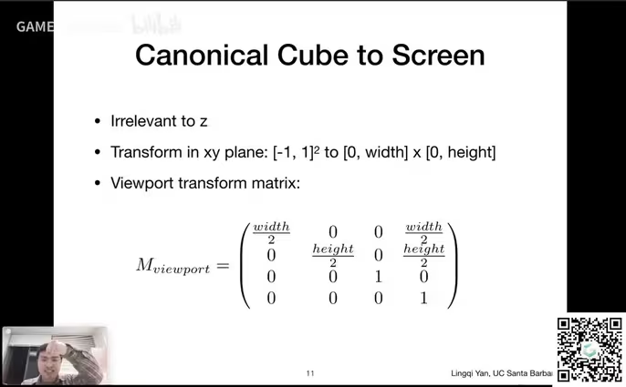

### 三角形

三角形是光栅化过程一个很重要的概念，现代图形学中几乎所有的模型都使用三角形构建。

**为什么光栅化选择了三角形？**

- 三角形是最基本的多边形，没有比三角形边更少的多边形
- 其他多边形都可以拆分为三角形
- 三角形必定在一个平面内
- 容易定义三角形的里外
- 三角形的三个点定义好后，三角形内任意一点都可以通过线性插值来计算得到（如：定义好三个点的颜色，三角形内任意一点的颜色可以通过三个点的颜色来进行插值计算得到）

#### 三角形如何转化为像素？

由于三角形的边是一个连续的函数，而像素是一个个点，所以我们需要将连续的函数“离散化”。

**简单近似采样**

给定一个连续的函数f(x)，当x=1是得到的f(1)就是1的采样。采样就是把一个函数离散化的过程。

只要有一个定义在屏幕空间的函数，那么我们就能算出来不同像素中心的值是多少

给定一个三角形，对像素中心进行采样来判断中心是否落在三角形内。

但是遍历所有像素开销太大，如图，白色那一列的像素根本没有碰到三角形，所以只要遍历蓝色区域就可以了

我们知道三角形三个顶点的坐标，有了Xmin，Ymin，Xmax，Ymax就可以得到蓝色的区域
，这个蓝色区域就叫做包围盒（轴向包围盒/BoundingBox/AABB）

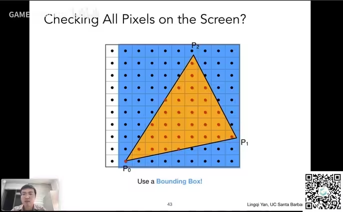

采样完成后，因为每个像素都是最小单位，像素内的颜色必须一样，所以我们会得到这样一副图

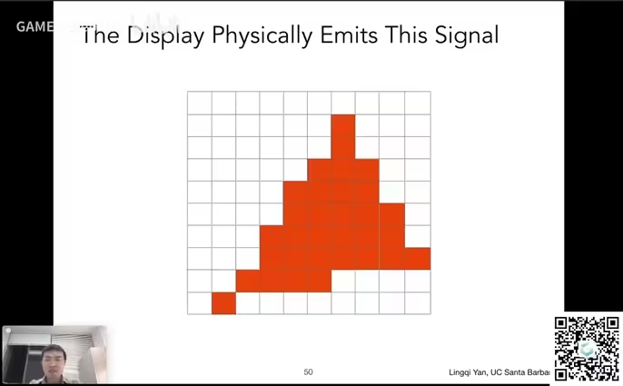

这看起来和初始的三角形差别很大，有一个个的明显锯齿（Jaggies/Aliasing），接下来我们来解决这一问题

## Lecture6 反走样 / 抗锯齿

我们需要对光产生的信息离散化产生的像素进行采样，形成照片。但是采样会产生一些问题：

- **走样**：由于采样频率不足，导致连续信号在离散化过程中产生失真‌
- **摩尔纹**：产生扭曲的纹理
- **车轮效应**：高速旋转的车轮看起来静止、缓慢移动甚至反向旋转

原因就是信号变化速度太快了，以至于采样的速度跟不上。

**反走样处理方法：采样前模糊**

先模糊再采样

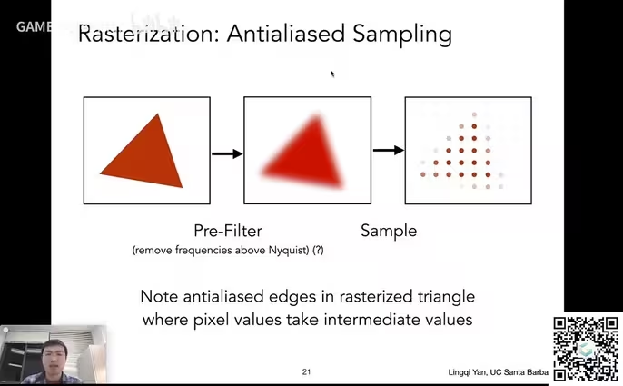

> 不能先采样再模糊！

要理解为什么会产生走样，我们先需要了解以下内容

### 频率分析基础

**频域、时域**

频域和时域是对信号或系统的两种不同的表示方式。

频域表示是通过分析信号的频率分布来表示信号的方式。在频域中，信号被分解为一系列不同频率的分量，每个分量对应着信号中的一种特定的周期性成分。

时域表示是通过直接分析信号在时间上的变化情况来表示信号的方式。在时域中，信号的变化被直接表示为在时间上的变化，而不是在频率上的变化。

**傅里叶级数展开**

指的是任何一个周期性的函数都可以变成一系列正弦/余弦的线性组合+一个常数项

**傅里叶变换**

一个函数f(x)可以通过变换得到另一个函数F(w)，F(w)也可以逆变换为f(x)

我们对五个不同频率的函数进行采样，图下图所示

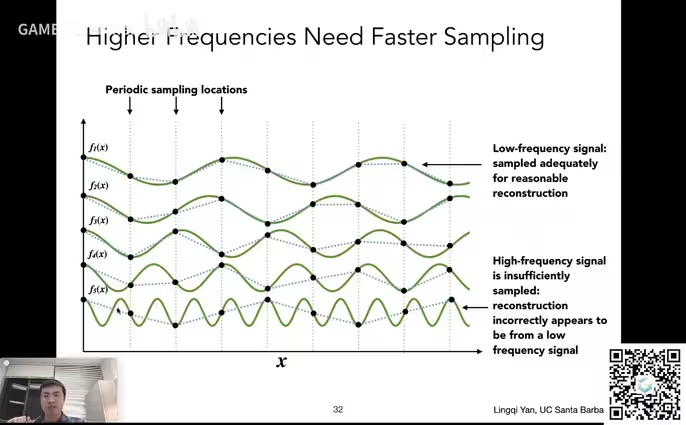

在f1(x)和f2(x)中进行采样，能够大致还原出f1(x)或f2(x)的函数波形，但是从f3(x)开始，还原出的波形由于采样频率的限制，还原出的波形与原函数有着较大的出入，频率越高越明显。

当我们同时对函数1和函数2进行采样，两个截然不同的函数，得到的采样结果却完全相同，这就是**走样**

### 滤波与卷积

#### 滤波

颜色变化越大的部分频率越高，往往代表着边界。滤波就是抹掉一些特定的频率，这就使我们可以通过滤波的方式对高频与低频信息进行过滤，从而找到边界与中心。

例如下面一张图：

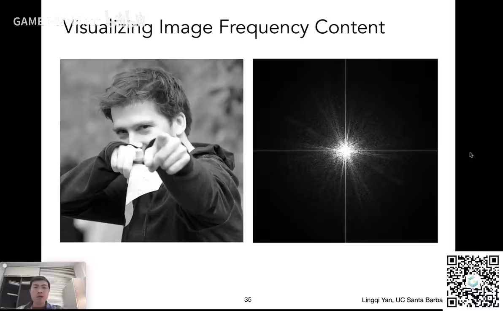

**高通滤波**：得到某一部分的边界

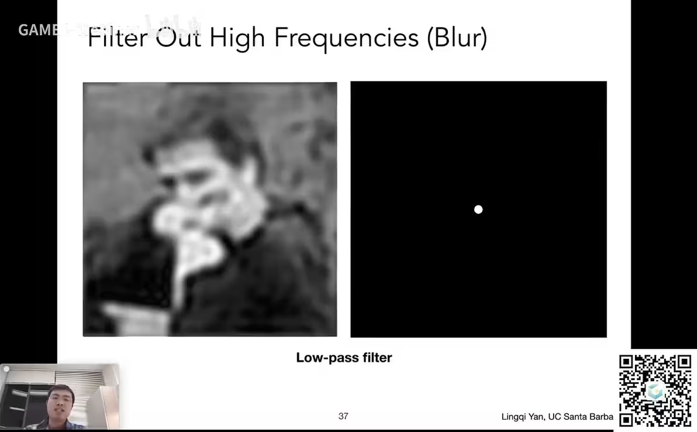

**低通滤波**：得到模糊的图像

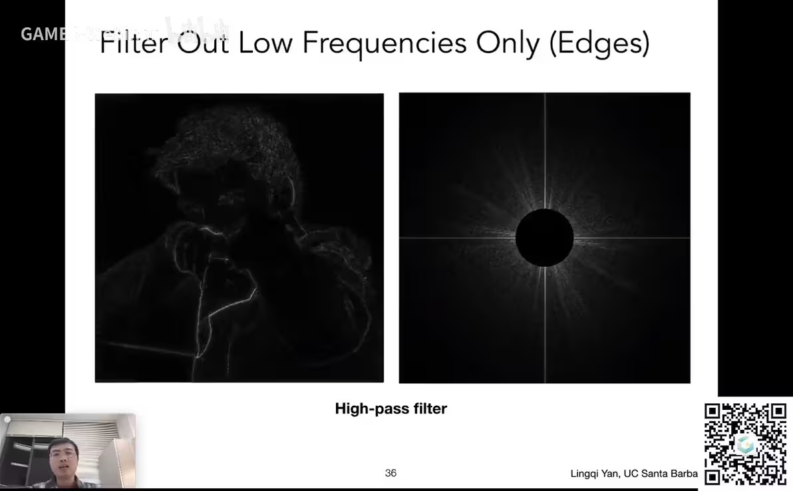

同理，我们还可以通过同时过滤高频和低频，得到多种图像，控制边界与模糊。

#### 卷积

可以理解为在信号任意位置用周围做加权平均。在图像处理这种离散情况下，可以看作一个滑动窗口在图像中滑动，对每个位置都计算一次周围元素的加权平均。

**卷积定理**

时域的卷积 == 频域的乘积

时域的乘积 == 频域的卷积

例如：假设我们使用一个3x3的卷积滤波器对一个图片进行卷积操作，你可以直接进行卷积，也可以：

1. 先傅里叶变换这幅图，将这幅图变到频域
2. 将卷积滤波器变到频域上
3. 将两者相乘，乘完后得到的频域的结果，将其逆傅里叶变换，变到时域上

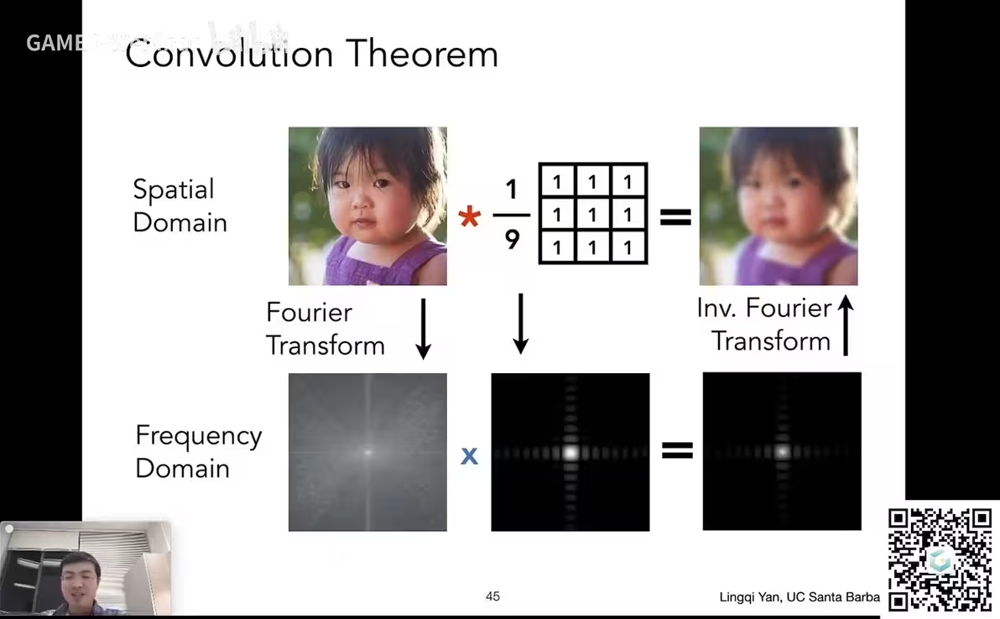

### 采样与走样的频率解释

基于上述知识点，采样可以理解为：将原始信号与冲击函数进行相乘

在频域中，采样相当于复制原始信号的频谱，表现为原始信号的频谱被以采样频率为间隔复制粘贴。

左边一列是时域，右边一列是频域

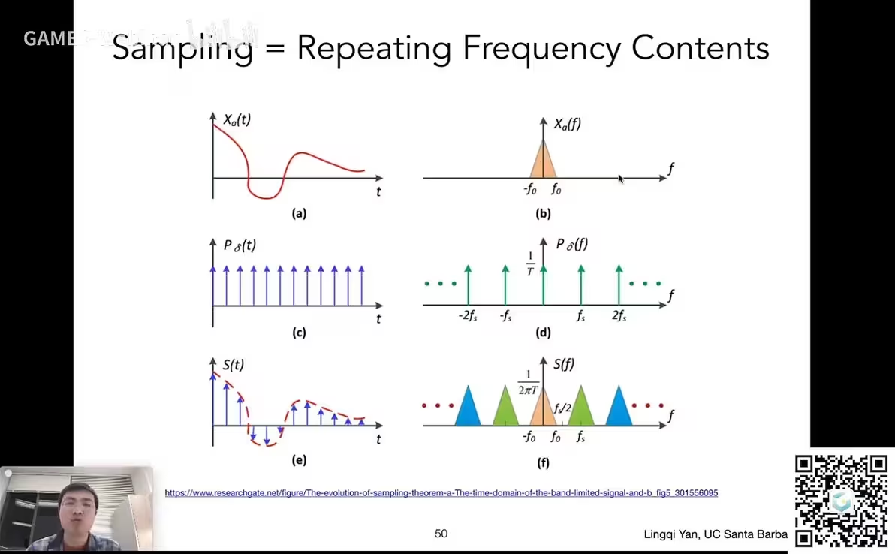

对于走样的产生，采样越稀疏，频谱复制间隔越小，频谱重叠越严重。而采样越密集，频谱复制间隔越大，越不易发生重叠。

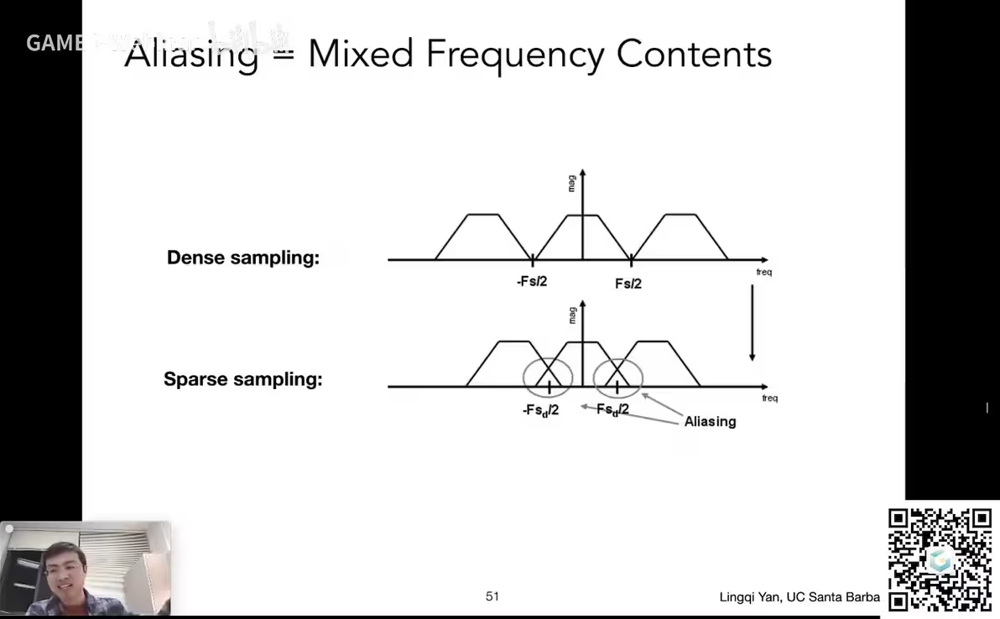

### 反走样

核心思想：先对图像做模糊处理，把高频信息切掉，再采样，减少重叠部分

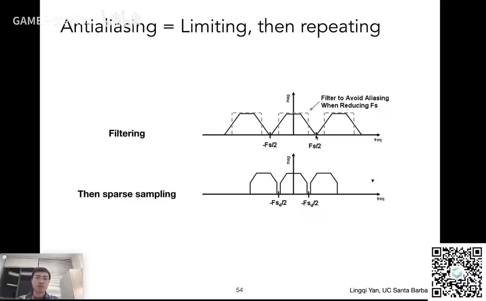

这样频域图像就不会发生混叠，也就没有走样了

**MSAA（Multi-Sample Anti-Aliasing）多重采样抗锯齿**

将一个像素划分为多个子样本，例如将一个像素分成四个子样本，判断每个子样本中心是否在三角形内，然后再计算覆盖率作为像素颜色值。

需要注意的是：MSAA并不是通过提高分辨率来解决的，而是近似计算覆盖面积，显示的像素个数还是相同的。

**FXAA（Fast Approximate Anti-Aliasing）快速近似抗锯齿**

FXAA本质上不对模型进行处理，而是一种基于图像的后处理方法。

首先得到有锯齿的图像，通过图像匹配找到边界，此时边界是带有锯齿的。然后再将边界替换为无锯齿的边界。速度更快且效果更好。

**TAA（Temporal Anti-Aliasing）时域抗锯齿**

TAA主要对静止场景效果好，因为该方法利用的是时间维度，即复用上一帧的信息，将MSAA的多个样本分布在时间上，而在当前帧不需要引入额外采样。

**Super Resolution 超分辨率**

超分辨率可以实现输入低分辨率图像而输出高分辨率图像，特别用于解决“采样率不够”的问题。

例如**DLSS（Deep Learning Super Sampling）**使用深度学习网络猜测缺失的细节

## Lecture7 深度缓冲 & 着色

### 深度缓冲

在光栅化过程中，我们需要确定哪些东西能够被最终显示在屏幕上，哪些东西被遮挡在后面，也就是**遮挡关系**的问题。

**画家算法**

在光栅化时，先画最远的物体，然后从远处开始逐渐画近的物体，这样进的物体就会覆盖远的物体。

这种方式最符合尝试，但是会导致一个问题：因为该算法是基于三角形整体坐标计算的，当存在多个相互遮挡（循环遮挡）的物体（三角形）时，我们无法判断三角形的远近，无法定义深度关系。

**Z-Buffer**

深度缓存算法在每个像素中记录其看到的最浅深度（离相机最近的深度），在渲染时不光要存渲染结果，还要存深度结果。

算法流程：

1. 首先将所有像素的深度设为无穷
2. 逐个处理每个三角形，进行光栅化
3. 对于每个在光栅化过程中重叠（同时存在两个三角形）的像素：zcurrent
    - 计算新三角形在该像素处的深度
    - 将新深度znew与当前记录的深度zcurrent进行比较
    - 如果znew < zcurrent
        - 更新深度缓存zcurrent = znew
        - 更新帧缓存：写入新三角形的颜色
    - 否则：忽略该三角形

伪代码如

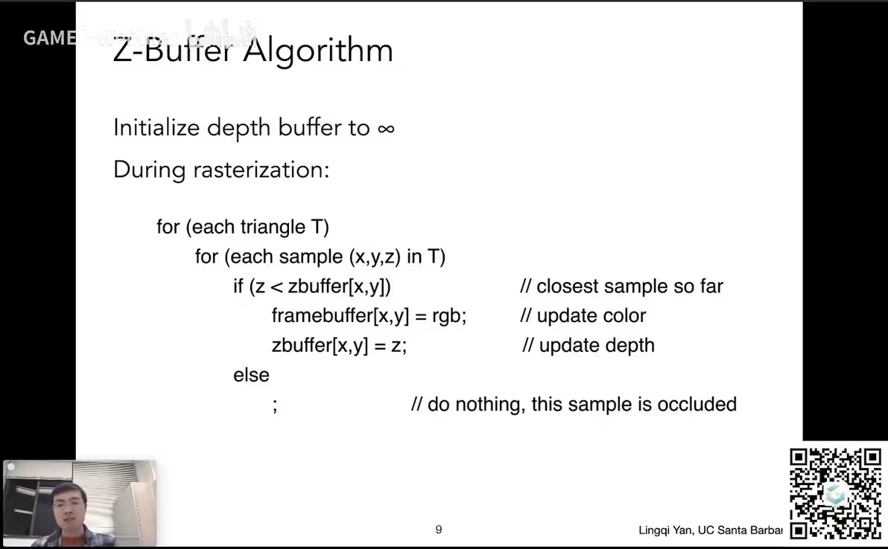图

### 着色

着色是指对不同物体应用不同材质的过程

着色模型由三部分组成：

1. 漫反射
2. 高光 / 镜面反射
3. 环境光

#### 着色点

表面上需要计算颜色的点称为**着色点**，渲染一个点，我们需要有以下输入：

- 观察方向v
- 点对应三角形的法向量n
- 光线方向l
- 表面参数（颜色、高光度等）

#### 漫反射

同样的光从不同角度照到同一平面上产生的明暗不一样。根据Lambert余弦定律，平面接收到的能量正比于n·l = cos_theta。在计算机中可以表示为公式max(0,n·l)。

又由于点光源需要向四周均匀辐射能量，根据能量守恒定律，距离光源越远，单位面积能量越小。即能量与距离平方成反比I/r2

最终漫反射强度的公式如图

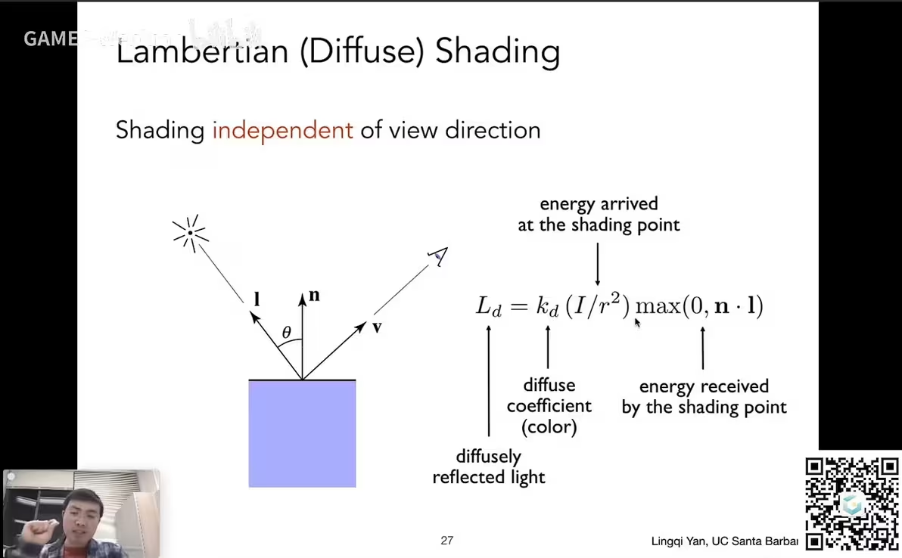

Kd表示该点颜色的反射率，如果用RGB通道表示，那么就是Color

## Lecture8 着色 2

### 高光

当表面光滑时，反射方向接近镜面反射方向时才能看到高光。为了便于计算，我们引入**半程向量h**：观察方向v与入射方向l的角平分线。

h = normalize(v+l)

所以为了知道能否看到高光，布林冯模型只需要知道n和h是否接近即可

如果用视线方向v和高光方向R来判断能否看到高光，就是冯模型，但是计算反射方向的计算量较大。

在计算是否能看到高光时，如果使用余弦值衡量角的大小，那么可看到高光的范围可能会很大，因为角度在很大的情况下余弦值仍然有很大的值。而正常情况下我们认为的高光都是很小很亮的。

在布林冯反射模型中，高光项Specular=ks·(n·h)p

其中ks为镜面反射系数，通常为白色。p为shiness指数，用于控制高光范围，常用范围约100~200之间

完整的布林冯反射模型包括环境光、漫反射以及高光

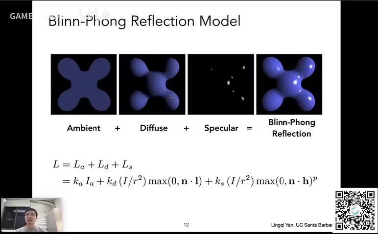

### 着色频率

着色频率不同表现不一样

下图从左到右分别为面着色，顶点着色与像素着色

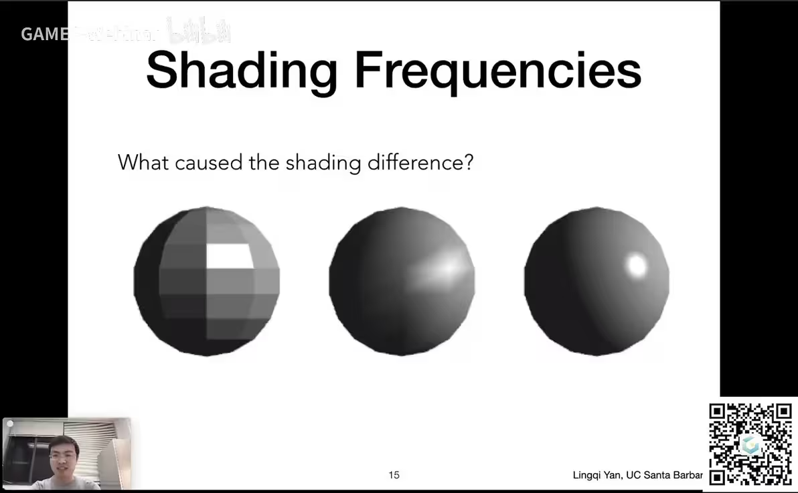

三种着色频率各有各的优点，需要根据情况判断。一般情况下：

|着色频率|着色位置|效果|
|---|---|---|
|Flat Shading|每个三角形|效果粗糙，可见三角形边界|
|Gouraud Shading|每个顶点|插值得到内部颜色|
|Phong Shading|每个像素|效果最细腻|

不同着色频率产生的效果也取决于模型本身，当几何足够复杂时用FlatShading得到的效果也很好。反之，当几何的面数大于像素数量时FlatShading的性能也不会好于PhongShading。

在实际应用中，我们一般选择Phong Shading

**如何求顶点的法线**

将和顶点相邻的面的法向量做加权平均

可以使用面积加权平均获得更好的效果

**如何求住逐像素的法线**

已知顶点法线，通过插值和重心坐标的方式求中间某一点的法线

### 图形渲染管线 / 实时渲染管线

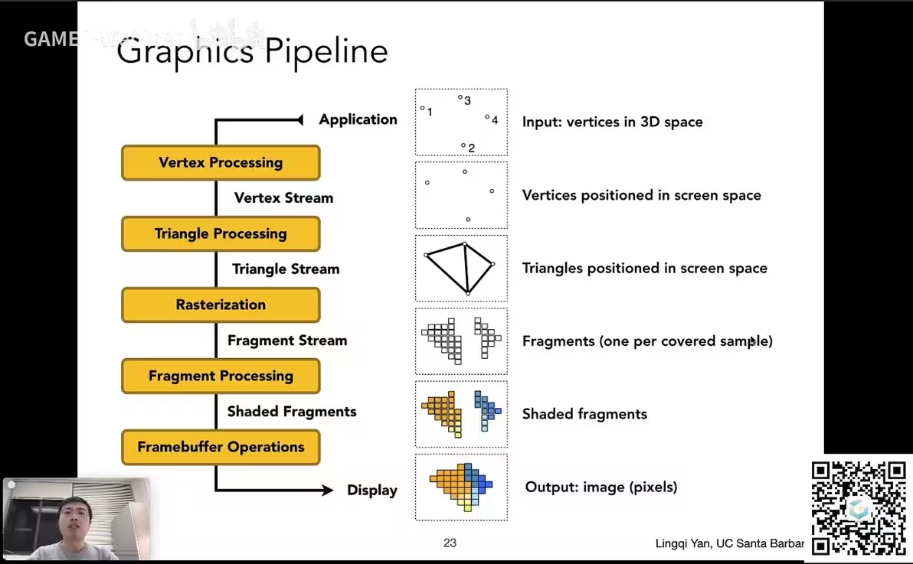

总体就是一下几步：

- 顶点处理：将三维空间的点投影在平面上
- 三角形处理：将这些点连接形成三角形
- 光栅化：将三角形离散成为屏幕上的Fragment（未经处理的像素）
- 着色：给像素上色
- 后处理：深度缓冲-处理遮挡关系，MSAA等抗锯齿

### Shader着色器

现代GPU中，这套渲染管线某些部分是可编程的，可以由开发者去定义顶点/像素如何着色，这部分代码就叫Shader。

如果写的是顶点操作，这个shader就叫做VertexShader（顶点着色器）

如果写的是像素操作，这个shader就叫做FragmentShader（片段/片元着色器）/PixelShader（像素着色器）

### TextureMapping纹理映射

当我们在一个物体上显示一张图片时，我们需要在不同位置显示不同的颜色。由于整体公用同一个着色模型，唯一的区别就是漫反射系数Kd不同，所以有一种方法，可以定义一个物体上任意一点的基本属性。

3D物体的表面其实都是2D的，比如地球仪，将地球仪上的图撕下来，可以平铺成一张2D的图。物体的表面，通过这种方式可以和一张图有一一对应的关系，这张图就叫纹理。将这张图平铺/裁剪/拉伸到任何物体表面，就叫纹理映射。

纹理上的坐标系通常用UV来表示，每个三角形关联一个UV坐标，三角形内部则通过插值来获得UV坐标。通常约定U和V的范围为[0,1]。

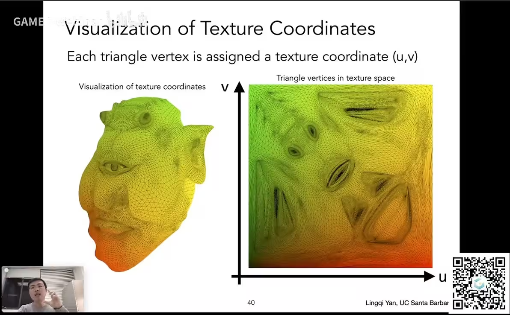

## Lecture9 着色 3

