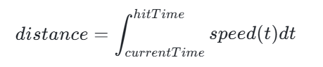

# 音符与判定线

Tags: 音乐游戏, Unity, 经验

> 该文档记录了我对音游中的一些开发问题的研究
>
> 游戏引擎为Unity

## 关于理论

音游的一大问题是如何计算音符距离判定线的距离。
>音游如何变速https://www.bilibili.com/video/BV1z5AezQEA6/

1. **音符判定时间**

首先，音符的判定必须以绝对时间计算，即音符在歌曲进度的某一时刻为0ms，且时间单位为毫秒。

如果使用音符距离判定线的距离为判定标准的话，会导致在流速极慢的情况下，音符在判定范围呆的时间过长。这样会让游戏变得很简单，不会因为视觉变速导致误判。(因为我之前就这么干过)

流速过慢导致距离判定线太近：

对于毫秒级打击判定的实现，我们需要在音符类中记录hitTime打击时间。

每一拍的时长为(60/BPM)s，假设音符在3.5拍，前面有BPM=120的2.5拍，后面的1拍为BPM=60，那么：

- time1=(2.5-0)×(60/120)=1.25s
- time2=(3.5-2.5)×(60/60)=1.0s
- hitTime=2.25s=2250ms

当前游戏时间可以通过音频直接获取(AudioSource.time，获取的单位为s，需要×1000转换为ms)。或者也可以使用Unity提供的高精度计时器(Time.realtimeSinceStartup)。

首先在玩家输入时记录输入的绝对时间inputTime，这样可以计算输入时间与判定时间(最近的音符)的绝对时间差dT，根据dT与判定精度分级来确定判定等级。这样就可以实现绝对的判定运算。

这是市面上所有主流音游的判定方式。

2. **音符距离判定线的计算**

目前主流的音符与判定线的距离的计算方式需要使用到积分。

我原来的设计是BPM与音符速率为两个同时影响音符真正移动速度的变量，但是这会导致程序上以及制谱器制作和使用非常麻烦。而现代的解决方式是将BPM与音符速率分开：

**BPM**：只影响判定时间与制谱器中辅助线的绘制，而不影响视觉表现。
**音符速率SV**：独立影响视觉表现。

距离计算公式：

其中speed(t)=玩家选择的速度×SV。

其中音符速率SV为一个曲线，是谱师在谱面的某一段时间(或整体)中对音符下落速度的修正，一般用乘算计算视觉表现下的音符下落速度。

SV曲线一般为直线与贝塞尔曲线，因为音符距离判定线的计算涉及积分，而积分的计算量较大，如果使用更复杂的积分会导致性能的下降，而性能下降对音游的影响是致命的。

当然，直接使用流速与节拍数(或dT)计算距离也可以为演出添加合适的效果，例如让音符先上升再下落。而且这样计算起来也很方便。

3. **如何实现**

osu!mania等游戏的实际实现参考：

用关键帧实现BPM与SV倍率的曲线。由于BPM的改变会导致节拍间隔变化，所以制谱器与游戏内的节拍线位置仍然采用积分的方式进行计算，然后通过计算额外的SV来抵消BPM带来的谱面速度变化。

在读取谱面时，可以读取BPM与SV的关键帧，然后预先记录好所有音符的判定时间与变速，运行时只进行读取或简单的积分。

---

## 实践

> 仓库（希望复刻osu!mania部分的核心玩法）：https://github.com/gzxx307/Tizaria

玩家与谱面数据结构：
