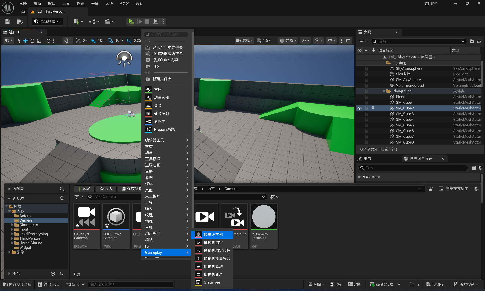
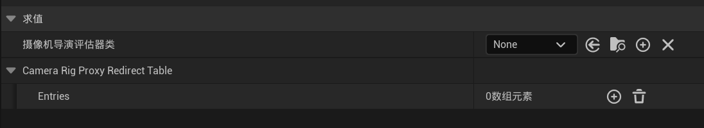
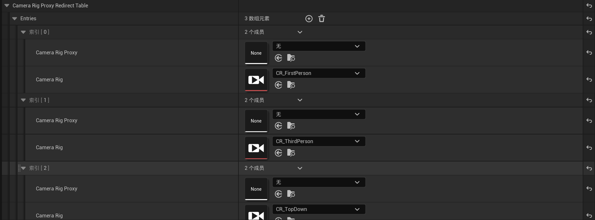
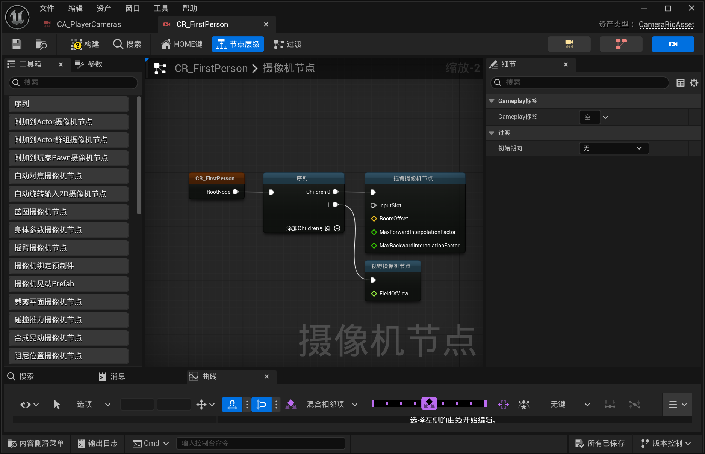
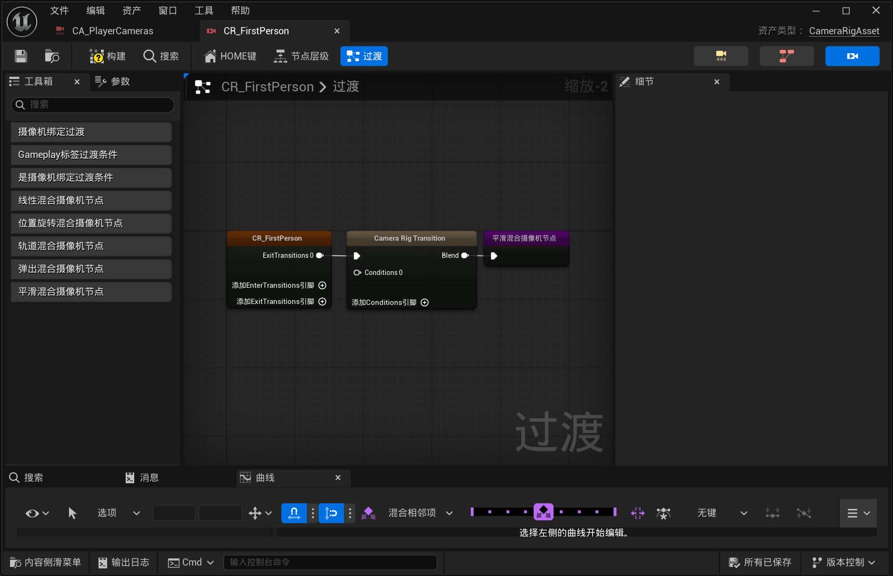
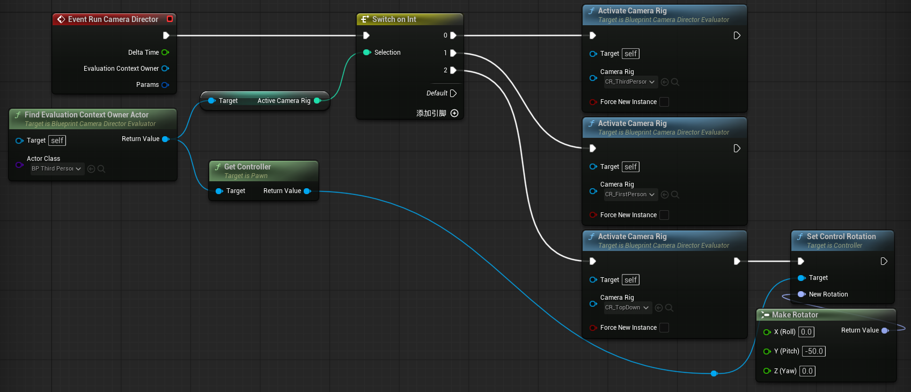
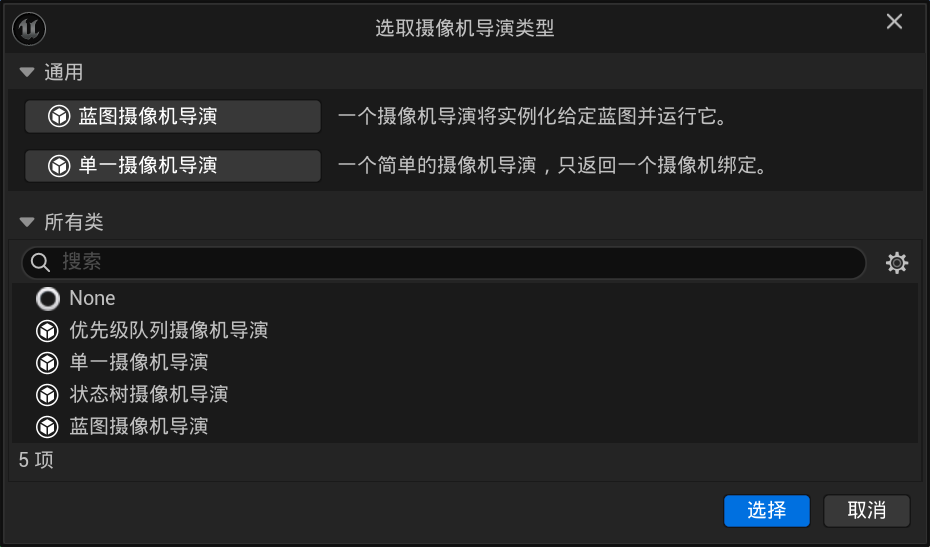
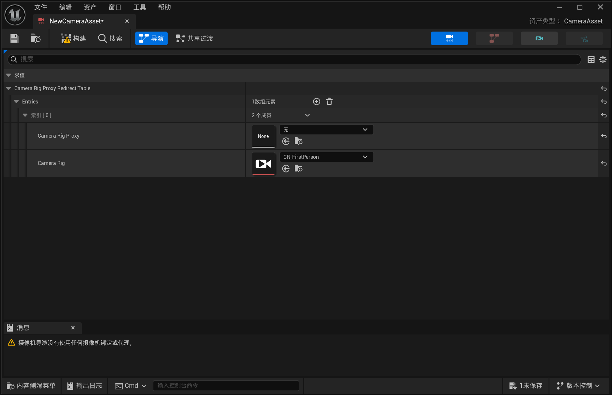
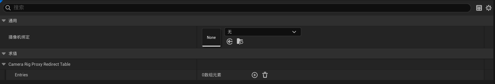

# UE实验性功能：Gameplay Camera

Tags: UE, 经验, 知识

## 前言

> **UE版本：5.7 | Gameplay Camera插件版本：0.1 (experimental)**
> 
> IDE: JetBrains Rider 2025.3.0.2

不同版本的蓝图操作以及功能不同，如果版本不同需要另外再看

而且目前UE官方还没有完成文档（或者说官方已经基本放弃写文档了），所以学起来会很麻烦

我是直接看的插件C++源码，后面开个claude code帮我解释大体的结构以及模块设计理念、为什么要这么设计之类的

> 官方文档链接[https://dev.epicgames.com/documentation/unreal-engine/gameplay-camera-system?application_version=5.7&lang=zh-CN](https://dev.epicgames.com/documentation/unreal-engine/gameplay-camera-system?application_version=5.7&lang=zh-CN)

这个官方文档用的似乎还是UE5.5版本的Gameplay Camera插件，所以跟我的实际实现不一样

所以**以下内容全都是我在UE版本为5.7的时候写的**，源码也参考5.7

另外，还需要确保你启用了Gameplay Camera插件

## 蓝图简单操作

首先介绍一下蓝图里怎么使用

> 这里首先介绍蓝图里的一些数据结构的基础结构与操作，具体的节点功能后面再说
> 
> 这里说的基础操作是参考的官方文档的使用示例，这个示例比较简单，但是因为UE版本不一样所以有很多坑，所以这里我重新整理了一遍

首先在文件夹中右键（或者点添加），看到Gameplay分类，该分类中的所有内容都与Gameplay Camera相关

其中必须有的几个为：

- （多个）摄像机绑定 Camera Rig
- 摄像机资产 Camera Asset

如果你在创建摄像机资产时选择使用"蓝图摄像机导演 Blueprint Camera Director"类型，那么则还需要一个"摄像机导演评估器 Camera Director Evaluator"

> Camera Asset可选择的类型共有四个，这里先通过Blueprint Camera Director演示摄像机导演的功能以及基本用法是什么
> 
> 这些东西都是干什么的以及前缀命名规范是什么？之后会讲到

首先我们先创建一个Camera Asset，选择使用"Blueprint Camera Director"，命名为`CA_PlayerCameras`。打开后你会发现一个类引用与一个数组

由于当前版本的UE还没有提供通过创建蓝图来创建摄像机导演评估器类的方式，所以我们需要在Camera Asset的属性中添加一个。

点击None右边的加号可以指定目录快速创建，建议是放在同级目录下，命名为`CDE_MyCameras`

创建好后，UE会自动将创建出来的蓝图类绑定到Camera Asset中

然后我们先不管创建出来的蓝图，可以看到下面还有一个数组。添加元素后UE要求我们向其中填入`Camera Rig Proxy`与`Camera Rig`，即摄像机绑定代理和摄像机绑定。实际上这里的Camera Rig Proxy不是必须的，这个类我们现在也暂时忽略，之后会讲到

这时再回到目录中，我们继续创建一个Camera Rig，命名为`CR_MyCamera1`，并在Camera Asset的数组元素的Camera Rig属性中绑定这一资产

下面我们进入刚刚创建的Camera Rig中，在"节点层级"面板中定义摄像机的行为逻辑，在"过渡"面板中，定义切换摄像机时进入和退出该摄像机的方式

进入我们的Camera Director Evaluator，默认显示一个`Event Run Cameras Director`事件，这个事件对应挂载该类的Camera Asset，在Camera Asset运行时，该事件在每Tick进行调用。在这里，你可以通过`Activate Camera Rig`（或`Activate Camera Rig Via Proxy`，但这里不做介绍）节点来控制当前激活哪个摄像机绑定

> 下面是我刚开始学的时候复现的官方文档的示例
> 
> 
> 
> 在PlayerController中定义整数变量`Active Camera Rig`，通过按键进行操控，然后再在CDE里switch并切换

你还可以在Camera Asset中的"共享过渡"面板定义该Camera Asset使用的所有Camera Rig在切换时，如果没有定义过渡时使用的过渡

最后，在你的角色蓝图添加Component"Gameplay摄像机组件"，并在细节面板中配置你创建的Camera Asset

至此，就是所有基础操作

## 蓝图工程中主要的类

### Camera Asset

继承自UCameraAsset，前缀通常为CA

事实上，创建CameraAsset的时候选择的分类，实际上都是继承自UCameraAsset，只是他们的Director有所不同。在源码中，设计了Director不同时显示不同字段。

所以实际上，选择CameraAsset分类的过程就是在选择Director的父类

CameraDirector顾名思义就是摄像机的"导演"，CameraAsset通过挂载CameraDirector，让在CameraDirector中编写的选择激活摄像机的逻辑能够应用到CameraAsset中

> 为什么要分开实现CameraAsset与CameraDirector？
> 
> 这需要与下面的CameraRigProxy合起来说，具体后面会写到
> 
> 简单来说就是解耦数据层与控制层

下面介绍了四个优先设计好的Director

#### 优先级队列摄像机导演 Priority Queue Camera Director

**该Director只适用于C++工程，纯蓝图工程无法使用该Director！如果要在纯蓝图项目中实现按照优先级选择摄像机，应该使用Blueprint Camera Director**

选择该导演类型时，你无法在纯蓝图中确定好CameraRig的切换逻辑，因为程序完全没有为蓝图暴露除数组外的其他任何可覆盖或可编程内容，该类是专门为C++部分暴露接口用的，要写逻辑要在C++里写

#### 单一摄像机导演 Single Camera Director

单一摄像机导演只拥有一个摄像机绑定，如果只有一个摄像机绑定的话，比起蓝图摄像机导演就只有创建更方便了

> 下面的摄像机绑定代理数组是多余的，只是由于他继承了Director基类所以显示出来了，但并没有任何作用

#### 蓝图摄像机导演 Blueprint Camera Director

#### 状态树摄像机导演 StateTree Camera Director

### Camera Rig

### 过渡 / 共享过渡

## 蓝图与源码的对应

> 启用了该插件时，该插件的源码位置在我的电脑中的位置：
> 
> D:\UE_5.7\Engine\Plugins\Cameras\GameplayCameras\Source\GameplayCameras

## 蓝图节点原理与实现