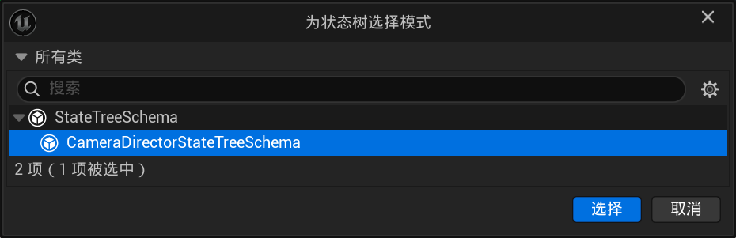

# UE实验性功能：Gameplay Camera

Tags: UE, 经验, 知识

## 前言

> **UE版本：5.7 | Gameplay Camera插件版本：0.1 (experimental)**
> 
> IDE: JetBrains Rider 2025.3.0.2

不同版本的蓝图操作以及功能不同，如果版本不同需要另外再看

而且目前UE官方还没有完成文档（或者说官方已经基本放弃写文档了），所以学起来会很麻烦

我是直接看的插件C++源码，后面开个claude code帮我解释大体的结构以及模块设计理念、为什么要这么设计之类的

> 官方文档链接[https://dev.epicgames.com/documentation/unreal-engine/gameplay-camera-system?application_version=5.7&lang=zh-CN](https://dev.epicgames.com/documentation/unreal-engine/gameplay-camera-system?application_version=5.7&lang=zh-CN)

这个官方文档用的似乎还是UE5.5版本的Gameplay Camera插件，所以跟我的实际实现不一样

所以**以下内容全都是我在UE版本为5.7的时候写的**，源码也参考5.7

另外，还需要确保你启用了Gameplay Camera插件

## 蓝图简单操作

首先介绍一下蓝图里怎么使用

> 这里首先介绍蓝图里的一些数据结构的基础结构与操作，具体的节点功能后面再说
> 
> 这里说的基础操作是参考的官方文档的使用示例，这个示例比较简单，但是因为UE版本不一样所以有很多坑，所以这里我重新整理了一遍

首先在文件夹中右键（或者点添加），看到Gameplay分类，该分类中的所有内容都与Gameplay Camera相关

其中必须有的几个为：

- （多个）摄像机绑定 Camera Rig
- 摄像机资产 Camera Asset

如果你在创建摄像机资产时选择使用"蓝图摄像机导演 Blueprint Camera Director"类型，那么则还需要一个"摄像机导演评估器 Camera Director Evaluator"

> Camera Asset可选择的类型共有四个，这里先通过Blueprint Camera Director演示摄像机导演的功能以及基本用法是什么
> 
> 这些东西都是干什么的以及前缀命名规范是什么？之后会讲到

首先我们先创建一个Camera Asset，选择使用"Blueprint Camera Director"，命名为`CA_PlayerCameras`。打开后你会发现一个类引用与一个数组

由于当前版本的UE还没有提供通过创建蓝图来创建摄像机导演评估器类的方式，所以我们需要在Camera Asset的属性中添加一个。

点击None右边的加号可以指定目录快速创建，建议是放在同级目录下，命名为`CDE_MyCameras`

创建好后，UE会自动将创建出来的蓝图类绑定到Camera Asset中

然后我们先不管创建出来的蓝图，可以看到下面还有一个table。添加元素后UE要求我们向其中填入`Camera Rig Proxy`与`Camera Rig`，即摄像机绑定代理和摄像机绑定。实际上这里的Camera Rig Proxy不是必须的，这个类我们现在也暂时忽略，之后会讲到

> 这里的table实际上是Proxy->Rig映射表，且该表不属于CameraAsset，这个后面讲

这时再回到目录中，我们继续创建一个Camera Rig，命名为`CR_MyCamera1`，并在Camera Asset的数组元素的Camera Rig属性中绑定这一资产

下面我们进入刚刚创建的Camera Rig中，在"节点层级"面板中定义摄像机的行为逻辑，在"过渡"面板中，定义切换摄像机时进入和退出该摄像机的方式

进入我们的Camera Director Evaluator，默认显示一个`Event Run Cameras Director`事件，这个事件对应挂载该类的Camera Asset，在Camera Asset运行时，该事件在每Tick进行调用。在这里，你可以通过`Activate Camera Rig`（或`Activate Camera Rig Via Proxy`，但这里不做介绍）节点来控制当前激活哪个摄像机绑定

> 下面是我刚开始学的时候复现的官方文档的示例
> 
> 
> 
> 在PlayerController中定义整数变量`Active Camera Rig`，通过按键进行操控，然后再在CDE里switch并切换

你还可以在Camera Asset中的"共享过渡"面板定义该Camera Asset使用的所有Camera Rig在切换时，如果没有定义过渡时使用的过渡

最后，在你的角色蓝图添加Component"Gameplay摄像机组件"，并在细节面板中配置你创建的Camera Asset

至此，就是所有基础操作

## 主要的类

> 为了更好理解每个类的作用，可以搭配[整体执行逻辑](#整体执行逻辑)一起食用
> 
> 这一板块除了介绍有哪些常见的类，这些类在蓝图中怎么使用的，还会介绍相对底层的设计与逻辑。启用了该插件时，该插件的源码位置在我的电脑中的位置：
> 
> D:\UE_5.7\Engine\Plugins\Cameras\GameplayCameras\Source\GameplayCameras

### Camera Asset

继承自UCameraAsset，前缀通常为CA

事实上，创建CameraAsset的时候选择的分类，实际上都是继承自UCameraAsset，只是他们的Director有所不同。在源码中，设计了Director不同时显示不同字段。

所以实际上，选择CameraAsset分类的过程就是在选择CameraDirector的父类

CameraDirector顾名思义就是摄像机的"导演"，CameraAsset通过挂载CameraDirector，让在CameraDirector中编写的选择激活摄像机的逻辑能够应用到CameraAsset中

> 为什么要分开实现CameraAsset与CameraDirector？
> 
> 这需要与下面的CameraRigProxy合起来说，具体后面会写到[摄像机绑定代理](#camera-rig-proxy)
> 
> 简单来说就是解耦数据层与控制层

CameraAsset中还有一个“共享过渡”，共享过渡是当该CameraAsset上挂载的CameraRig没有定义过渡的Enter或Exit时，使用共享过渡的Enter或Exit

> 过渡在后面的[过渡](#过渡)

CameraRig的映射表放置所有该CameraAsset能够切换和调用的CameraRig，并通过DirectorEvaluator实现CameraRig或CameraRigProxy之间的切换

在运行时，CameraAsset会被实例化，此时产生CameraEvaluationContext（CameraAsset中挂载数据、配置变量，而CameraEvaluationContext则是运行时状态）。运行时，同一个CameraAsset可以同时产生多个Context（比如多人游戏中每个玩家一个，类似PlayerState）

### CameraEvaluationContext

其存储了运行时状态

### ChildCameraEvaluatorContext

子Context本质还是上面的Context类，只是作为父Context的委托对象

父Context的Director可以委托给子Context来决定摄像机行为，子Context拥有自己的CameraAsset和Director，运行自己独立的摄像机逻辑

可以理解为父Context决定使用哪个子Context，之后的逻辑让子Context决定，这样就可以套娃

子Context的创建有两种来源：

1. 另一个UGameplayCameraComponent用InsertOrPush模式激活时，自动成为当前Context的子节点
2. 通过C++代码主动创建

### Camera Director

UE目前为Director设计了四个不同的子类，每个子类都实现父类的虚函数OnBuildEvaluator，函数返回一个Evaluator。每个子类返回的Evaluator都是不同的，但都继承自FCameraDirectorEvaluator

> 关于[CameraDirectorEvaluator](#camera-director-evaluator)在下面会讲到

下面介绍四个子类

#### 优先级队列摄像机导演 Priority Queue Camera Director

**该Director只适用于C++工程，纯蓝图工程无法使用该Director！如果要在纯蓝图项目中实现按照优先级选择摄像机，应该使用Blueprint Camera Director**

选择该导演类型时，你无法在纯蓝图中确定好CameraRig的切换逻辑，因为程序完全没有为蓝图暴露除数组外的其他任何可覆盖或可编程内容，该类是专门为C++部分暴露接口用的，要写逻辑要在C++里写

那么我们应该如何使用呢？在下面的[在C++中扩展](#在c中扩展)章节详写

#### 单一摄像机导演 Single Camera Director

单一摄像机导演只拥有一个摄像机绑定，如果只有一个摄像机绑定的话，比起蓝图摄像机导演就只有创建更方便了

> 下面的摄像机绑定代理数组是多余的，只是由于他继承了Director基类所以显示出来了，但并没有任何作用

#### 蓝图摄像机导演 Blueprint Camera Director

当选择摄像机蓝图导演类时，CameraAsset要求挂载一个“摄像机导演评估器类”，但实际上，评估器类这个变量是通过蓝图摄像机导演暴露出来的，是蓝图摄像机导演拥有评估器类而不是CameraAsset，CameraAsset拥有的是蓝图摄像机导演

蓝图摄像机导演是UCameraDirector的子类，作为数据层。且该子类只有一个变量即CameraDirectorEvaluatorClass（也就是在工程里被暴露出来的那个变量），其余所有属性均与父类相同

蓝图摄像机导演评估器类本质上是一个Blueprintable的UObject，在使用蓝图继承的Evaluator中自定义摄像机的切换逻辑。Director的Evaluator通过调用蓝图中的函数来定义切换摄像机的逻辑

关于蓝图摄像机导演评估器类，看[关于蓝图摄像机导演评估器类](#blueprint-camera-director-evaluator)

#### 状态树摄像机导演 StateTree Camera Director

与上文的蓝图摄像机导演相同，蓝图摄像机导演持有的是一个“类”，而状态树摄像机导演持有的是一个“资产”

Director通过该资产（状态树）驱动摄像机的切换

> 由于状态树在UE的不同领域也有用到，但不同领域的状态树需求不同，例如`StateTreeSchema`是为游戏中的AI行为设计的。所以创建状态树时需要使用CameraDirectorStateTreeSchema类，以支持ActivateCameraRig等操作），同时状态树内部的节点只能是摄像机领域相关的。
> 
> 
> 
> 具体看[StateTree](#state-tree)

### Camera Director Evaluator

Evaluator中定义了该Director切换CameraRig的逻辑

#### Blueprint Camera Director Evaluator

工程中命名蓝图前缀一般为CDE

> 实际上在工程中创建的蓝图仅仅只是个蓝图而已，真正的BlueprintCameraDirectorEvaluator是纯C++的，即在创建Evaluator时通过C++创建，Evaluator只是调用了蓝图的函数从而达到控制激活CameraRig的目的

评估器中提供了一个事件和另外四个可重载函数，一般除了RunCameraDirector事件是需要重写的以外，其他的都不需要。

**RunCameraDirector事件**

该事件的调用与`Event Tick`类似，每一帧调用一次，主要用于决定该帧运行的CameraRig或子Context

主要的三个函数：

- `ActivateCameraRig(CameraRig)`直接激活一个Rig
- `ActivateCameraRigProxy`：通过代理激活
- `RunChildCameraDirector(DeltaTime, SlotName)`：把决策权委托给某个子Context

当该事件没有被重载或没有连接到任意激活摄像机绑定的函数时，编译会警告你没有激活摄像机绑定

**ActivateCameraDirector事件**

该事件类似`BeginPlay`，当Context被推入摄像机系统栈时触发，一般用于初始化状态

**DeactivateCameraDirection事件**

类似`EndPlay`，当Context被弹出时触发

**AddChildEvaluationContext(ChildContextOwner)函数**

这时一个被动回调，当外部有子Context要附加进来时，通知当前Context，这样Context就能够获取到子Context的信息从而控制

该函数的返回值FName即插入进来的Context的名称，可以使用这个FName传入RunChildCameraDirector调用

此外，评估器还在继承Blueprint基本功能的基础上添加了大量函数

### State Tree

### Camera Rig

继承自UCameraRigAsset，蓝图一般前缀为CR

CameraRig的执行和计算涉及到多个类的协同工作，这些类在下面详细讲，但其核心流程是当该Rig被激活时，调用该Rig的RootNode（摄像机节点根节点）的Evaluator，然后再对不同的层进行求值与合并，最终得到计算出的位置结果

其核心属性有：

- TObjectPtr<UCameraNode> RootNode：摄像机节点数的根节点
- FGameplayTagContainer GameplayTags：用于匹配过渡条件的标签
- TArray<TObjectPtr<UCameraRigTransition>> EnterTransitions：对应蓝图的过渡图表中的进入过渡列表
- TArray<TObjectPtr<UCameraRigTransition>> ExitTransitions：对应蓝图的过渡图表中的退出过渡列表
- ECameraRigInitialOrientation InitialOrientation：初始朝向策略

#### NodeHierarchy面板

定义CameraRig运动逻辑的节点树由一系列UCameraNode的子类构成，其根节点为RootNode

可以理解为每个节点都是一个函数，一个RootNode通过调用以下的多个函数定义每一帧的摄像机的行为

所有官方提供的节点：

**变换**

- SetLocationCameraNode：直接设置摄像机世界位置
- SetRotationCameraNode：直接设置摄像机世界旋转
- OffsetCameraNode：在当前摄像机位置上叠加偏移（包括位移和旋转），可以选择偏移空间
- BoomArmCameraNode：摇臂节点；设置一个相对其父对象位置的偏移作为旋转中心，摄像机向旋转中心后方延伸一段距离并面向一点（类似官方的第三人称模式里自带的第三人称摇臂），可以接收2D输入
- DampenPositionCameraNode：位移阻尼/平滑，可以对前后、左右、上下三个方向分别做低通滤波，0为默认无滤波，数值越大平滑越不明显
- DampenRotationCameraNode：旋转阻尼/平滑，类似上面的节点，对Yaw、Pitch、Roll三个旋转轴分别做低通滤波

**镜头与机身**

- FieldOfViewCameraNode：设置FOV
- LensParametersCameraNode：镜头参数（包括焦距、对焦距离、光圈）
- FilmbackCameraNode：传感器/胶片参数（传感器宽度、高度、偏移、过扫描、宽高比约束）
- BodyParametersCameraNode：机身参数（快门速度和ISO感光度）
- OrthographicCameraNode：设置为正交投影，并设置正交宽度
- ClippingPlanesCameraNode：设置进/远裁剪平面距离

**渲染与对焦**

- PostProcessCameraNode：叠加后处理
- AutoFocusCameraNode：自动对焦，将对焦距离自动设为当前目标距离，并且可以设置阻尼/平滑

**逻辑控制**

- Sequence：序列节点，和蓝图一样依次执行
- CameraRigPrefab：嵌入运行另一个CameraRig资产
- TargetRayCastCameraNode：射线目标节点，从摄像机位置发射射线确定目标

**样条线**

- SplineOffsetCameraNode：沿样条线偏移摄像机位置
- SplineOrbitCameraNode：沿样条线轨道运动
- SplineFieldOfViewCameraNode：沿样条线改变FOV

**构图**

构图节点可以根据屏幕空间中目标的位置自动调整摄像机，使目标保持在画面中的理想位置上

- BaseFramingCameraNode：构图基类，定义目标Actor、理想构图位置、DeadZone、SoftZone与阻尼参数，子类只需要重载"如何移动或旋转来重新框住目标"就行
- DollyFramingCameraNode：推拉构图，通过左右或上下平移来重新框住目标
- PanningFramingCameraNode：摇镜构图，通过原地旋转来重新框住目标

**输入**

- Input2DCameraNode：2D输入抽象基类
- InputAxisBinding2DCameraNode：从InputAction读取轴输入，可以设置为累积模式或非累积模式，
- InputAccumulator2DCameraNode：将输入值逐帧累加
- RawInputAxisBinding2DCameraNode：从InputAction读取原始轴值，不含累积
- DrivenControlRotationCameraNode：输入跟随ControlRotation，在混合退出时解除，并对最后已知朝向施加增量旋转
- AutoRotateInput2DCameraNode：设置摄像机的自动回正，在一段时间无操作后将摄像机自动旋转回默认朝向

**附着**

将摄像机附着到Actor或Pawn

- AttachToActorCameraNode：附着到指定Actor，可跟随位置或旋转
- AttachToPlayerPawnCameraNode：附着到玩家Pawn，可跟随位置或旋转，支持Socket或Bone
- AttachToActorGroupCameraNode：附着到一组Actor的中心

**抖动**

模拟摄像机的震动效果

- CameraShakeCameraNode：嵌入运行一个CameraShake资产
- ShakeCameraNode：抖动节点基类
- PerlinNoiseLocationShakeCameraNode：柏林噪声位置抖动
- PerlinNoiseRotationShakeCameraNode：柏林噪声旋转抖动
- CompositeShakeCameraNode：组合抖动，将多个抖动子节点组合执行
- EnvelopeShakeCameraNode：通过包络控制抖动，有进入、持续、释放三个阶段

**碰撞**

处理摄像机与场景几何体的交互：

- CollisionPushCameraNode：碰撞推离，当摄像机与场景碰撞时推向安全位置，默认为Pivot或Pawn位置，带Push/Pull插值器，如果为异步碰撞检测则可以不阻塞主线程从而提升性能
- OcclusionMaterialCameraNode：遮挡透明，当Actor遮挡摄像机视线时对其应用透明材质

**工具**

- BlueprintCameraNode：蓝图自定义节点，在BluePrint中编写CameraNode逻辑，可以定义自定义行为

#### 过渡

每个CameraRig都有属于自己的过渡列表，定义了该Rig在Enter或Exit时与其他Rig的混合行为，除此之外，CameraAsset中还有一个共享过渡

由于可能存在多个过渡，例如前一个摄像机的Exit和后一个摄像机的Enter，而多个过渡无法融合到一起，所以过渡之间存在一个查找优先级：

1. 旧Rig定义的Exit
2. 旧Rig所属的CameraAsset的共享Exit
3. 新Rig定义的Enter
4. 新Rig所属的CameraAsset的共享Enter

每次查找都会进行条件匹配，如果条件匹配成功则使用该过渡，如果没有则顺延到下一个过渡。如果四步都没找到则直接硬切

##### UCameraRigTransition

条件匹配定义在了UCameraRigTransition类中，这个类对应蓝图中的节点就是每次创建Enter或者Exit时必须添加的第一个节点

有几个关键变量：

- TArray<TObjectPtr<UCameraRigTransitionCondition>> Conditions：定义了该Transition的匹配条件
- TObjectPtr<UBlendCameraNode> Blend：定义过渡方式
- ECameraRigInitialOrientation InitialOrientation以及后面的一个bool变量：可选是否重载初始朝向

其中UCameraRigTransitionCondition目前官方提供了两个节点：一个用于摄像机匹配，一个用于Gameplay标签匹配

官方提供了部分继承自UBlendCameraNode的节点：

- LinearBlendCameraNode：线性混合，固定时间内BlendFactor从0均匀变化到1，结果通过插值计算
- SmoothBlendCameraNode：平滑混合，基于SmoothStep或SmootherStep曲线，开头结尾缓入缓出
  > SmoothStep：
  > 
  > SmootherStep：
- PopBlendCameraNode：硬切（瞬移）
- LocationRotationBlendCameraNode：位置和旋转分别混合，内嵌两个独立的SimpleBlend，可以为位移和旋转分配不同的曲线或时长
- OrbitBlendCameraNode：轨道混合（摄像机沿弧形路径从旧位置绕到新位置）

> 其继承关系为：UBlendCameraNode->USimpleBlendCameraNode(引入BlendFactor)->USimpleFixedTimeBlendCameraNode(引入固定时间计时)->LinearBlend/SmoothBlend
> 
> LinearBlend和SmoothBlend的核心区别仅有OnComputeBlendFactor的返回值曲线不同

如果需要自行扩充节点，看下面[在C++中扩展](#在c中扩展)

#### Camera Rig Proxy

CameraRigProxy继承自UCameraRigProxyAsset，一般命名为CRP

UCameraRigproxyAsset中只有Guid一个属性，而且该属性还没有暴露给蓝图，所以你打开该资产时会发现里面什么都没有，因为他就是什么都没有。

之前说CameraAsset中的摄像机绑定表是一个键值对数组，Key为CameraRigProxy，value为CameraRig。Director能够指定CameraRig启用，也可以通过CameraRigProxy间接启用CameraRig，所以在CameraAsset的CameraRig表中，Proxy是可有可无的。

如果Director试图启用某个没有被添加进Table的Proxy，程序通常会直接无视，即跳过运行

**那为什么会设计这个东西？**

UCameraRigProxyAsset本质上只是一个FGuid包装器，其作用是提供间接引用，目的是为了让代码能够更好的复用

没有Proxy时，Director为了切换到正确的CameraRig需要我们手动硬编码，如果另外一套CameraAsset需要具有相同的切换逻辑只是启用的CameraRig不同，那么就需要额外写或者复制一套逻辑

而当我们使用Proxy时，同一套逻辑可以指向不同的CameraRig，这样能够节省大量在蓝图中修改的时间，而且让错误能够更容易发现，只需要在CameraAsset里看Table配的对不对就行

### Gameplay Camera Component

即在蓝图中添加的Component

GameplayCameraComponent是一个SenceComponent，其在Actor中的主要功能是持有CameraAsset引用、创建运行时EvaluationContext、把求值结果输出给引擎的摄像机系统

与GameplayCameraComponent并列的还有一个GameplayCameraRigComponent，与GameplayCameraComponent不同的是，其持有的引用为单个CameraRig而非一个CameraAsset

插件还提供了一个Actor类AGameplayCameraActor，这是一个简单的Actor包装器，内部有一个UGameplayCameraComponent，并在Actor成为目标时自动启用摄像机，这样就能在世界中放置一个单独的摄像机了

其有以下核心属性：

- FCameraAssetReference CameraReference（GameplayCameraComponent）：引用要运行的CameraAsset（FCameraAssetReference是一个包装器结构体，里面有CameraAsset和Params）
- FCameraRigAssetReference CameraRigReference（GameplayCameraRigComponnet）：引用CameraRig
- TEnumAsByte<EAutoReceiveInput::Type> AutoActivateForPlayer：是否在BeginPlay时自动为指定玩家激活，每一个玩家下标为一个枚举值
- bool bSetControlRotationWhenViewTarget：是否将计算结果回写至PlayerController的ControlRotation
- bool bRunInEditor：编辑器中是否也运行摄像机（用于预览的小窗）
- int32 EditorPreviewCameraRigIndex：编辑器中预览的Rig索引

其中，GameplayCamera还为蓝图提供了大量节点，这里不再说明

## 整体执行逻辑

### 运行时实例化

1. 从UGameplayCameraComponentBase继承而来的GameplayCameraComponent执行BeginPlay()
2. UGameplayCameraComponentBase::BeginPlay()->如果启用“为玩家自动启用”则调用ActivateCameraForPlayerIndex(PlayerIndex)间接调用ActivateCameraForPlayerController，否则直接调用ForPlayerController创建，但不给任何Controller
   > Context进入时其实进入的是ContextStack栈
   > 
   > GetActiveContext()方法永远返回栈顶，摄像机系统每帧只处理栈顶的Context
   > 
   > 这里的ActivationMode有三种模式，分别在ActivateCameraEvaluationContext()函数中switch三个不同的行为：
   > 
   > 1. Push：新Context成为栈顶，一般用于完全切换到另一个摄像机
   > 2. PushAndInsert：旧的栈顶Context被设为新Context的子Context，新的Context成为栈顶，一般用于扩展摄像机功能
   > 3. InsertOrPush：如果栈里有东西（即有ActiveContext），那么新Context成为旧Context的子Context，否则操作退化为Push
3. ActivateCameraForPlayerController()->先Deactivate所有Context，然后获取PlayerControllerHost，调用ActivateCameraEvaluationContext()并传入对应PlayerController
4. ActivateCameraEvaluationContext()->调用CreateCameraEvaluationContext(PlayerController)并应用ActivateMode行为
5. CreateCameraEvaluationContext()->创建EvaluationContext并初始化所有属性
6. 在ActivateCameraEvaluationContext调用时，会将Context Push到ContextStack中，并让Stack执行Context->Activate(ActivateParams)激活最新的Context
7. FCameraEvaluationContext::Activate(ActivateParams)->调用AutoCreateDirectorEvaluator
8. 在AutoCreateDirectorEvaluator函数中，获取到我们创建CameraAsset时选择的CameraDirector类，创建一个Builder并调用该类的BuildEvaluator(Builder)方法获得DirectorEvaluator并初始化。BuildEvaluator方法调用OnBuildEvaluator虚函数，这个虚函数在每个子类中各自实现
   > **这里的Builder有什么用？**
9. 执行DirectorEvaluator->Activate()，将自身的FCameraSystemEvaluator* Evaluator变量设为当前Context配置的Evaluator，并触发BlueprintCameraDirectorEvaluator的ActivateCameraDirector事件

### 每帧更新

1. FCameraSystemEvaluator执行Update()，从已激活的ActiveContext中取出DirectorEvaluator，调用UpdateCameraDirector()函数时传入该Evaluator
2. UpdateCameraDirector()->执行Evaluator->Run()，Run()函数调用OnRun()虚函数，该虚函数在各个子类中实现
   > 例如FBlueprintCameraDirectorEvaluator子类实现了调用BlueprintCameraDirectorEvaluator类的NativeRunCameraDirector函数，然后再调用RunCameraDirector事件，也就是打开蓝图看到的第一个事件节点

## 蓝图节点原理与实现

## 在C++中扩展

## 一些问题与思考

### 为什么设计Evaluator

在该插件的源码中，你会发现Evaluator无处不在，每次要进行计算的时候都会有一个Evaluator

可以将Evaluator理解为一个运行时状态以及运行方式

一般的Evaluator是运行时生成的，激活时Evaluator都会被Build一次，然后再执行Run，即执行逻辑

设计Evaluator有如下几点好处：

1. 在一个多人游戏中，一个CameraRig资产可能被多个玩家使用，但是由于CameraRig只是一个资产，而将一个资产复制给每个玩家的开销和需求量较大，所以我们可以通过共享的方式提供给每个玩家。此时如果多个玩家同时操作CameraRig的数据，这肯定会导致问题。所以我们设计一个简单的独立状态容器，让Evaluator作为一个运行时状态在每个玩家处运行
2. 在编辑器中修改CameraRig的节点树后，引擎可以保留BlendStack的结构而只重建被修改的Evaluator，这样其在BlendStack上的位置以及ID都不会变，热重载时很有效
3. 通过Evaluator层，我们可以清晰的决定哪些数据是需要序列化的、哪些数据需要网络复制、哪些是计算中间值等等，使代码更加结构化

### UPROPERTY(Instanced)

UPROPERTY的Instanced关键字是什么意思？为什么在这个插件的源码里到处都是？

当一个属性拥有Instanced这个参数时，该属性会为拥有它的对象创建一个自己的专属新实例，可以理解为在父对象的构造函数中自动实例化了一个新的属性，而不是等程序手动分配对象或者手动创建

与使用普通指针不同的是，该实例的生命周期跟随其父对象，即当父对象销毁时，该实例也会一并销毁

当我们使用Instanced修饰一个属性时（一般是引用对象），代表每一个父对象都有一个专属的子对象，就像CameraAsset中每个Asset都有自己的Director和Transitions

本质上，Instanced是为了让子对象被当作"值"类型，而非"引用"类型，类似成员变量的值对象与指针的区别

> 通常，与UPROPERTY(Instanced)配套出现的还有UCLASS里的标记DefaultToInstanced和EditInlineNew
> 
> - DefaultToInstanced：当类本身标记了这个，类里的UPROPERTY即使不写Instanced也会默认instanced，但是一般还是显式写，因为不是每个属性都要Instanced，而且显式写更直观
> - EditInlineNew：允许在编辑器的Details面板中直接通过"+"按钮新建该类的内嵌对象，例如上文提到的在CameraAsset的细节面板里创建BlueprintCameraDirectorEvaluator时点的"+"号